#   // Homepage 

> I'm a developer that works with data science, workflows in AI & ML, and modeling in mathematics & physics!
>
> I have a passion for finding solutions by analyzing real data. For any inquiries or a private consultation on business solutions, feel free to contact me! notkosoto@gmail.com
\
\

> 

## Tools & Languages 
Primarily I use Java, C++, Python, KNIME, Tensorflow, & more.

## Currently Working On

- Workflow patterns involving: time-series analysis, ARIMA modeling, seasonal decomposition, missing value imputation, & out-of-sample forecasting validation for applications in predictive analysis.
- Workflow patterns involving: recommendation systems, association rule mining, data pipelines for preference analysis & automated recommendations using user's social media & behaviour patterns.

- An Introduction to Galois Representations - by Alvaro Lozano-Robledo
- Hypergeometric Functions, Character Sums and Applications - by Ling Long 

<!--
**n75uxy190/n75uxy190** is a ✨ _special_ ✨ repository because its `README.md` (this file) appears on your GitHub profile.

Here are some ideas to get you started:

- 🔭 I’m currently working on ...
- 🌱 I’m currently learning ...
- 👯 I’m looking to collaborate on ...
- 🤔 I’m looking for help with ...
- 💬 Ask me about ...
- 📫 How to reach me: ...
- 😄 Pronouns: ...
- ⚡ Fun fact: ...
-->
